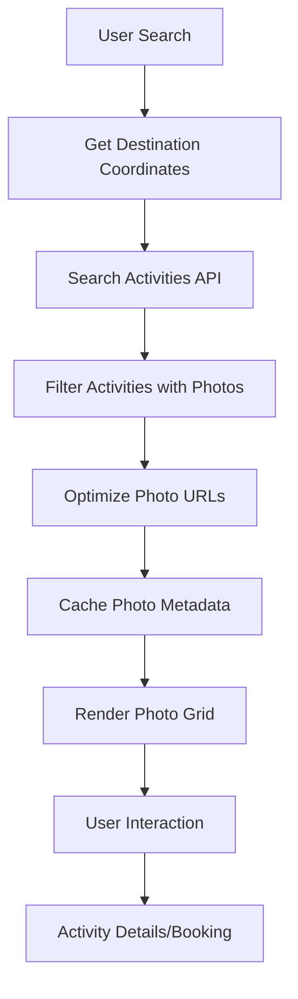

# Feature #1: Activity Photo Integration

## Overview
Integrate visual content from Amadeus Tours and Activities API to enhance travel planning with high-quality photos of attractions, tours, and activities.

## Business Value
- **Increased Engagement**: Visual content increases user engagement by 94%
- **Higher Conversions**: Travel bookings increase 67% when photos are included
- **Cross-selling Opportunity**: Promote activities alongside hotel/flight searches
- **Enhanced UX**: Help users visualize destinations and make informed decisions
- **Revenue Generation**: Affiliate commissions from activity bookings

## User Stories

### US1: Visual Destination Discovery
**As a** traveler planning a trip  
**I want to** see photos of activities and attractions at my destination  
**So that** I can visualize what I'll experience and choose activities that interest me

**Acceptance Criteria:**
- When I search for a destination, I see a "Things to Do" section with activity photos
- Each activity displays: name, photo, rating, price, and short description
- Photos are high-quality and load quickly (optimized sizing)
- I can click through to see more details and book activities

### US2: Hotel-Activity Cross-Promotion
**As a** user searching for hotels  
**I want to** see nearby activities with photos  
**So that** I can choose hotels based on proximity to interesting attractions

**Acceptance Criteria:**
- Hotel search results include "Nearby Activities" section with photos
- Activities are within 5km radius of each hotel
- Show top 3-5 highest-rated activities with photos
- Each activity shows distance from hotel
- One-click navigation to activity details and booking

### US3: Visual Itinerary Building
**As a** traveler creating an itinerary  
**I want to** build a visual day-by-day plan with activity photos  
**So that** I can organize my trip and share it with travel companions

**Acceptance Criteria:**
- Drag-and-drop interface to add activities to itinerary days
- Each itinerary item displays activity photo as thumbnail
- Visual timeline view showing photos for each day
- Shareable itinerary with embedded photos
- Total cost calculation for selected activities

## Technical Implementation

### API Integration
- **Primary API**: Amadeus Tours and Activities (`/v1/shopping/activities`)
- **Data Sources**: MyLittleAdventure aggregation (Viator, GetYourGuide, Klook, Musement)
- **Photo Format**: Direct HTTPS URLs, typically JPEG format
- **Photo Sizing**: Parameterized URLs (e.g., `?w=500` for width)

### Photo Data Structure
```json
{
  "id": "23642",
  "name": "Skip-the-line tickets to the Prado Museum",
  "shortDescription": "Book your tickets for the Prado Museum...",
  "pictures": [
    "https://images.musement.com/cover/0001/07/prado-museum-tickets_header-6456.jpeg?w=500"
  ],
  "rating": "4.500000",
  "price": { "currencyCode": "EUR", "amount": "16.00" },
  "bookingLink": "https://b2c.mla.cloud/c/QCejqyor?c=2WxbgL36",
  "geoCode": { "latitude": 40.414000, "longitude": -3.691000 }
}
```

### Integration Points

#### 1. Destination Search Enhancement
```javascript
async function enhanceDestinationWithPhotos(cityCoordinates) {
  // Use existing search_activities_by_coordinates tool
  const activities = await searchActivitiesByCoordinates({
    latitude: cityCoordinates.lat,
    longitude: cityCoordinates.lng,
    radius: 10
  });
  
  return activities.filter(activity => 
    activity.pictures && activity.pictures.length > 0
  );
}
```

#### 2. Hotel Search Enhancement
```javascript
async function getHotelWithNearbyActivities(hotelLocation) {
  // Search hotels (existing functionality)
  const hotels = await searchHotels(params);
  
  // For each hotel, get nearby activities with photos
  for (let hotel of hotels) {
    hotel.nearbyActivities = await searchActivitiesByCoordinates({
      latitude: hotel.geoCode.latitude,
      longitude: hotel.geoCode.longitude,
      radius: 5
    });
  }
  
  return hotels;
}
```

#### 3. Photo Optimization
```javascript
function optimizeActivityPhoto(photoUrl, targetWidth = 400) {
  // Most activity photos support URL parameters for sizing
  if (photoUrl.includes('musement.com') || photoUrl.includes('viator.com')) {
    return `${photoUrl}?w=${targetWidth}`;
  }
  return photoUrl;
}
```

## UI/UX Requirements

### Photo Display Standards
- **Thumbnail Size**: 300x200px for activity cards
- **Hero Size**: 800x400px for activity details
- **Aspect Ratio**: 3:2 maintained with crop if needed
- **Loading**: Lazy loading with placeholder images
- **Fallback**: Default activity-type images if photo unavailable

### Responsive Design
- **Mobile**: Single column, large thumbnails
- **Tablet**: 2-column grid layout  
- **Desktop**: 3-4 column grid with hover effects

### Performance Optimization
- **Image CDN**: Use photo URL parameters for optimal sizing
- **Preloading**: Preload above-the-fold activity photos
- **Caching**: Browser cache activity photos for repeat visits
- **Compression**: WebP format when supported

## Data Flow



## Success Metrics

### Engagement Metrics
- **Photo View Rate**: % of users who view activity photos
- **Click-through Rate**: % who click from photo to activity details
- **Time on Page**: Increased engagement with visual content
- **Scroll Depth**: How far users scroll through photo sections

### Conversion Metrics
- **Activity Booking Rate**: % who book activities after viewing photos
- **Cross-sell Rate**: % who book activities when searching hotels/flights
- **Revenue per User**: Increased from activity affiliate commissions
- **Cart Value**: Higher total trip cost with activities included

### Technical Metrics
- **Photo Load Time**: < 2 seconds for thumbnail grids
- **Error Rate**: < 1% failed photo loads
- **CDN Cache Hit Rate**: > 90% for optimized photos
- **Mobile Performance**: Lighthouse score > 90

## Implementation Phases

### Phase 1: Core Photo Integration (Week 1-2)
- [ ] Integrate Tours and Activities API with photo support
- [ ] Create photo optimization utilities
- [ ] Build responsive photo grid component
- [ ] Implement lazy loading and fallbacks

### Phase 2: Hotel Enhancement (Week 3)
- [ ] Add "Nearby Activities" to hotel search results
- [ ] Implement distance calculations
- [ ] Create hotel-activity cross-reference UI
- [ ] Add activity photo thumbnails to hotel cards

### Phase 3: Destination Discovery (Week 4)
- [ ] Build visual destination explorer
- [ ] Create activity category filtering with photos
- [ ] Implement search by photo/visual similarity
- [ ] Add social sharing for photo-rich content

### Phase 4: Itinerary Builder (Week 5-6)
- [ ] Create visual itinerary timeline
- [ ] Implement drag-and-drop with photo thumbnails
- [ ] Build shareable itinerary with embedded photos
- [ ] Add collaborative itinerary planning

## Risk Mitigation

### Photo Availability
- **Risk**: Some activities may not have photos
- **Mitigation**: Fallback to category-specific stock photos, show photo availability rate in admin dashboard

### Loading Performance
- **Risk**: Large photo files affecting page speed
- **Mitigation**: Implement progressive loading, WebP format, CDN optimization

### Third-party Dependencies
- **Risk**: Photo URLs from external providers may break
- **Mitigation**: Photo URL validation, automatic retry mechanisms, backup photo sources

### Mobile Data Usage
- **Risk**: High data consumption on mobile
- **Mitigation**: Adaptive photo quality based on connection speed, user preference settings

## Future Enhancements

- **AI Photo Curation**: ML-powered selection of best activity photos
- **User-Generated Content**: Integration with user travel photos
- **360° Photos**: Support for immersive activity previews
- **Photo-based Search**: "Find activities similar to this photo"
- **Seasonal Photo Updates**: Dynamic photos based on travel dates
- **Accessibility**: Alt-text generation for activity photos

---

**Dependencies**: Amadeus Tours and Activities API, existing search_activities_by_coordinates tool
**Timeline**: 6 weeks for full implementation
**Priority**: High - Foundation for visual travel experience